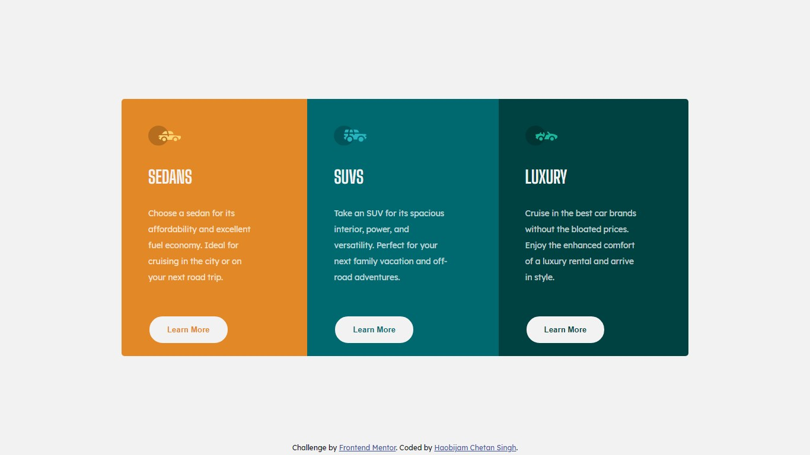

# Frontend Mentor - 3-column preview card component solution

This is a solution to the [3-column preview card component challenge on Frontend Mentor](https://www.frontendmentor.io/challenges/3column-preview-card-component-pH92eAR2-). Frontend Mentor challenges help you improve your coding skills by building realistic projects. 

## Table of contents

- [Overview](#overview)
  - [The challenge](#the-challenge)
  - [Screenshot](#screenshot)
  - [Links](#links)
- [My process](#my-process)
  - [Built with](#built-with)
  - [What I learned](#what-i-learned)
  - [Continued development](#continued-development)
  - [Useful resources](#useful-resources)
- [Author](#author)
- [Acknowledgments](#acknowledgments)

**Note: Delete this note and update the table of contents based on what sections you keep.**

## Overview

### The challenge

Users should be able to:

- View the optimal layout depending on their device's screen size
- See hover states for interactive elements

### Screenshot



### Links

- Solution URL: [3 Column Preview Card Component Solution URL](https://github.com/chetanhaobijam/3_Column_Preview_Card_Component)
- Live Site URL: [3 Column Preview Card Component Live Site URL](https://chetanhaobijam.github.io/3_Column_Preview_Card_Component/)

## My process

### Built with

- Semantic HTML5 markup
- CSS custom properties
- Flexbox
- Mobile-first workflow

### What I learned

While doing this website project I learn many things about Flexbox, CSS Positions and how we can change the CSS styles of an element when it change states e.g. when it go to hover, focus mode etc.


```css
.main {
  display: flex;
}

.card {
  position: relative;
}

.card:first-child .more:hover {
  border-color: var(--very-light-gray);
  color: var(--very-light-gray);
  background-color: var(--bright-orange);
}

.attribution { 
  position: absolute;
  inset: auto auto 5px auto;
}
```


### Continued development

I would like to learn more about CSS by doing further Frontend Mentor projects. These will help me improve my Front End Web Development skills.

### Useful resources

- [Free Code Camp](https://www.freecodecamp.org/learn) - By doing Free Code Camp Exercises I learn a lot about HTML and CSS.
- [Traversy Media Youtube Channel](https://www.youtube.com/channel/UC29ju8bIPH5as8OGnQzwJyA) - All the front end development related videos of this channel help me a lot in improving my skill.
- [W3C Schools](https://www.w3schools.com/) - Great website for code references.

## Author

- Frontend Mentor - [@chetanhaobijam](https://www.frontendmentor.io/profile/chetanhaobijam)
- Twitter - [@chetanhaobijam](https://www.twitter.com/chetanhaobijam)

## Acknowledgments

Thanks to Matt and his team for creating such a great website where we can do coding challenges and test our frontend skills. Looking forward for next challenge.
